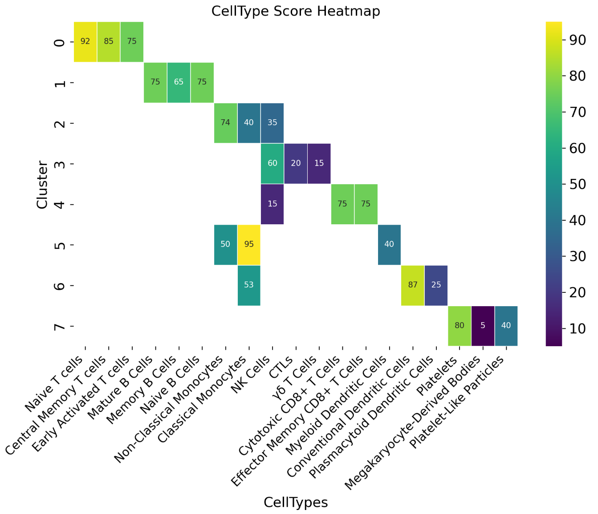
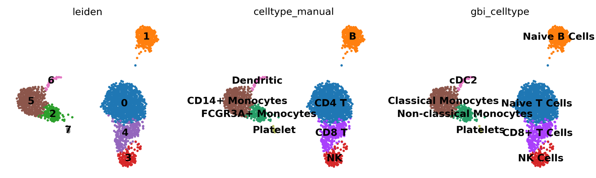

# Celltype Annotation
## Installation 

install GPTBioinsightor using pip:

```shell
pip install gptbioinsightor
```

## Usage


### Demo

Here, we will use the classic 10x Genomics PBMC data to demonstrate how to use GPTBioinsightor. GPTBioinsightor is a Python program, and we use Scanpy for single-cell data analysis.

In Unix system, you can download pbmc data like:
```shell
mkdir data
wget http://cf.10xgenomics.com/samples/cell-exp/1.1.0/pbmc3k/pbmc3k_filtered_gene_bc_matrices.tar.gz -O data/pbmc3k_filtered_gene_bc_matrices.tar.gz
cd data; tar -xzf pbmc3k_filtered_gene_bc_matrices.tar.gz
```

Then perform single-cell data processing in a Python environment:
```python

# For more detailed Scanpy data processing, please refer to  https://scanpy.readthedocs.io/en/stable/tutorials/basics/clustering-2017.html

import scanpy as sc

adata = sc.read_10x_mtx(
    "data/filtered_gene_bc_matrices/hg19/",  # the directory with the `.mtx` file
    var_names="gene_symbols",  # use gene symbols for the variable names (variables-axis index)
    cache=True,  # write a cache file for faster subsequent reading
)

adata.var_names_make_unique()  

sc.pp.filter_cells(adata, min_genes=200)
sc.pp.filter_genes(adata, min_cells=3)

# annotate the group of mitochondrial genes as "mt"
adata.var["mt"] = adata.var_names.str.startswith("MT-")
sc.pp.calculate_qc_metrics(
    adata, qc_vars=["mt"], percent_top=None, log1p=False, inplace=True
)

adata = adata[adata.obs.n_genes_by_counts < 2500, :]
adata = adata[adata.obs.pct_counts_mt < 5, :].copy()

sc.pp.normalize_total(adata, target_sum=1e4)

sc.pp.log1p(adata)

sc.pp.highly_variable_genes(adata, min_mean=0.0125, max_mean=3, min_disp=0.5)
adata.raw = adata
adata = adata[:, adata.var.highly_variable]

sc.pp.regress_out(adata, ["total_counts", "pct_counts_mt"])

sc.pp.scale(adata, max_value=10)
sc.tl.pca(adata, svd_solver="arpack")
sc.pp.neighbors(adata, n_neighbors=10, n_pcs=40)

sc.tl.leiden(
    adata,
    resolution=0.9,
    random_state=0,
    flavor="igraph",
    n_iterations=2,
    directed=False,
)
sc.tl.umap(adata)
sc.tl.rank_genes_groups(adata, "leiden", key_added="deg_key")
pathway_dic = gbi.enrich(adata, key="deg_key", pval=0.05, n_jobs=2, gene_sets="WikiPathways_2024_Human")
```

Performing cell type annotation using GPTBioinsightor:
```python
# set LLM API KEY
import os

os.environ['API_KEY'] = "sk-***"
## or API KEY for anthropic
os.environ['ANTHROPIC_API_KEY'] = "sk-***"


import gptbioinsightor as gbi

# set background information of data
background = "Cells are PBMCs from a Healthy Donor" 

# Here, use claude-3-5-sonnet-20241022 of anthropic, 
# but you also can use other supported LLM provider.
# if you also want to list references papers, 
# you should set , search_model="sonar", and set PERPLEXITY_API_KEY
res = gbi.get_celltype(adata, background=background, 
                       out="gbi.claude.celltype.md", key="deg_key", 
                       pathway=pathway_dic,
                       topnumber=15,provider="anthropic", 
                       n_jobs=4,model="claude-3-5-sonnet-20241022")
# {'0': {'Naive T cells': '92',
#   'Central Memory T cells': '85',
#   'Early Activated T cells': '75'},
#  '1': {'Mature B Cells': '75', 'Memory B Cells': '65', 'Naive B Cells': '75'},
#  '2': {'Non-Classical Monocytes': '74',
#   'Classical Monocytes': '40',
#   'NK Cells': '35'},
#  '3': {'NK Cells': '60', 'CTLs': '20', 'γδ T Cells': '15'},
#  '4': {'Cytotoxic CD8+ T Cells': '75',
#   'NK Cells': '15',
#   'Effector Memory CD8+ T Cells': '75'},
#  '5': {'Classical Monocytes': '95',
#   'Non-Classical Monocytes': '50',
#   'Myeloid Dendritic Cells': '40'},
#  '6': {'Conventional Dendritic Cells': '87',
#   'Classical Monocytes': '53',
#   'Plasmacytoid Dendritic Cells': '25'},
#  '7': {'Platelets': '80',
#   'Megakaryocyte-Derived Bodies': '5',
#   'Platelet-Like Particles': '40'}}
## score heatmap
gbi.utils.score_heatmap(res)
```


Comparing the results with manual annotations based on classic gene markers
```python
cell_type_name = {
    "0": "CD4 T",
    "1": "B",
    "2": "FCGR3A+ Monocytes",
    "3": "NK",
    "4": "CD8 T",
    "5": "CD14+ Monocytes",
    "6": "Dendritic",
    "7": "Platelet",
}

adata.obs["celltype_manual"] = adata.obs["leiden"].map(
    cell_type_name
)
adata.obs["celltypes_gbi"] = adata.obs["leiden"].map(
    res
)
sc.pl.umap(adata, color=["leiden", "celltype_manual", "celltypes_gbi"], legend_loc="on data", frameon=False)

```



You can find more annotation information in `gbi.qwen.celltype.md`:
```markdown
### Celltype Prediction
#### Naive T cells (score: 95)

Cell state: Resting/quiescent naive state

**Key Markers**:
- Cell-type-specific: CD3D, CD3E, LCK, CD2, CD7
- Cell-state-specific: IL7R, CCR7, LTB

**Evidence and Reasoning**
The presence of multiple core T cell markers (CD3D, CD3E) definitively establishes T cell lineage identity, while LCK provides additional confirmation as a critical TCR signaling component. The naive state is strongly supported by high IL7R and CCR7 expression, which are characteristic of naive T cells requiring IL-7 for survival and lymph node homing capability. The expression of LTB (Lymphotoxin Beta) further supports a naive phenotype, as it's important for lymphoid tissue organization. The overall gene signature suggests a resting state, lacking major effector cytokines or activation markers. This profile is highly consistent with naive T cells in healthy PBMC populations, where they typically constitute a major lymphocyte subset. The presence of housekeeping genes like TPT1 and EEF1A1 indicates basic cellular maintenance without signs of active effector functions.

**Validation**: CD45RA, SELL, TCF7, LEF1

#### Central Memory T cells (score: 90)

Cell state: Resting memory state

**Key Markers**:
- Cell-type-specific: CD3D, CD3E, LCK, CD2, CD7
- Cell-state-specific: CD27, CCR7

**Evidence and Reasoning**
The cell type is firmly established as T cells through the expression of TCR complex components (CD3D, CD3E) and T cell-specific signaling molecule LCK. The memory phenotype is supported by CD27 expression, a costimulatory molecule important for memory T cell function and survival. The presence of CCR7 suggests these could be central memory T cells, which retain lymph node homing capacity. The moderate expression of IL7R is consistent with memory T cells, which require IL-7 signaling for maintenance, though typically at lower levels than naive cells. The gene profile indicates a resting memory state rather than recently activated cells, fitting with the homeostatic conditions of healthy PBMCs. The absence of effector cytokines supports a quiescent memory state.

**Validation**: CD45RO, CD44, CXCR3, CD62L

#### Early-stage Activated T cells (score: 75)

Cell state: Initial activation phase

**Key Markers**:
- Cell-type-specific: CD3D, CD3E, LCK, CD2, CD7
- Cell-state-specific: JUNB, JUN

**Evidence and Reasoning**
The core T cell identity is well-established through classical T cell markers (CD3D, CD3E, LCK). The activation state is suggested by the presence of immediate early response genes JUNB and JUN, which are induced rapidly upon T cell activation. However, the activation signature is relatively weak, lacking strong activation markers like CD69 or CD25. The presence of IL7R, which typically decreases upon activation, suggests these cells might be in a very early stage of activation or potentially transitioning from a resting state. The metabolic gene signature (LDHB, EEF1A1) could indicate increased cellular activity, though these changes are not specific to activation. This profile could represent T cells encountering initial activation signals in the peripheral blood.

**Validation**: CD69, CD25, CD38, HLA-DR

### Novel Insights
The gene expression profile reveals an interesting pattern where T cells maintain markers associated with tissue homing (CCR7) while showing signs of transcriptional activity (JUN/JUNB). This suggests a potential "poised" state where cells maintain trafficking capability while being prepared for rapid response. The presence of IL32, typically associated with T cell function but not commonly discussed in naive T cell biology, might indicate previously unappreciated roles in T cell homeostasis. The co-expression pattern of housekeeping genes with immune-specific markers provides insights into the baseline metabolic state of circulating T cells in healthy conditions.


```