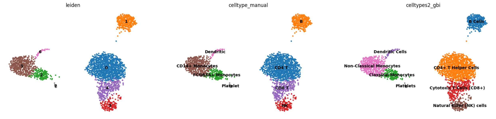

# Cell subtype Annotation

In the previous tutorial, we could see that the two Monocytes/Macrophages cell clusters were not distinguished. This might be due to the LLM's context limitations or a lack of strong prompt. Here, we can further guide the LLM to perform cell subtype identification.

## Usage

Performing cell subtype annotation using GPTBioinsightor:
```python
from anndata import AnnData
background = "Cells are Monocytes/Macrophages cells from a Healthy Donor" 
rsub = gbi.get_subtype(adata, group=["2","5"], key="logreg_deg" ,background=background, celltype="Monocytes/Macrophages", out="Subtype.md", topnumber=25, provider="anthropic", model="claude-3-5-sonnet-20241022")
rsub
# {'2': 'Classical Monocytes', '5': 'Non-classical Monocytes'}
```

Comparing the results with manual annotations
```python

adata.obs["celltypes2_gbi"] = adata.obs["celltypes_gbi"].tolist()
adata.obs.loc[adata.obs["leiden"]=="2","celltypes2_gbi"] = 'Classical Monocytes'
adata.obs.loc[adata.obs["leiden"]=="5","celltypes2_gbi"] = 'Non-Classical Monocytes'
sc.pl.umap(adata, color=["leiden", "celltype_manual", "celltypes2_gbi"], legend_loc="on data", frameon=False)

```



You can find more annotation information in `Subtype.md`. The contents of `Subtype.md` is as follows:
```markdown
# Cell Subtype
### Geneset 2: Classical Monocytes
**Gene marker**: FCGR3A, LST1, MT2A, FCER1G, IFITM2, AIF1, LILRA3, RHOC, IFITM3, STXBP2, PSAP, SAT1, NINJ1, MS4A7, ABI3, DRAP1, SERPINA1, CHCHD10, COTL1, ATP5I, LYN, LRRC25, TYROBP, RP11-290F20.3, CD79B
**Subtype gene marker**: FCGR3A, FCER1G, LYN
**Reason**: The presence of FCGR3A (CD16) and FCER1G (Fc epsilon receptor I gamma chain) indicates a classical monocyte phenotype, which is characterized by high expression of these receptors. LYN, a Src family tyrosine kinase, is also typically expressed in monocytes and is involved in signaling pathways that regulate their function.
**Cell state**: In a healthy donor, these classical monocytes are likely in a surveillance state, patrolling tissues and blood for signs of infection or tissue damage. They may also be involved in antigen presentation and initiation of immune responses.

### Geneset 5: Non-classical Monocytes
**Gene marker**: S100A8, LYZ, S100A9, LGALS2, FCN1, CD14, GSTP1, FTL, MS4A6A, CFD, NPC2, TYROBP, GRN, APOBEC3A, GPX1, NCF2, IER2, CTSS, S100A6, CSF3R, LGALS1, LGALS3, CST3, CEBPD, TMEM176B
**Subtype gene marker**: S100A8, S100A9, LGALS1, LGALS3
**Reason**: The genes S100A8 and S100A9 encode proteins that form heterodimers known as calprotectin, which are highly expressed in non-classical monocytes and associated with inflammation and host defense. LGALS1 and LGALS3 (galectins) are also characteristic of non-classical monocytes and play roles in cell-cell interactions during immune responses.
**Cell state**: These non-classical monocytes might be in a state of readiness for migration into tissues, where they can differentiate further into macrophages or dendritic cells. In a healthy individual, they could be involved in maintaining tissue homeostasis and responding to minor inflammatory stimuli.


```