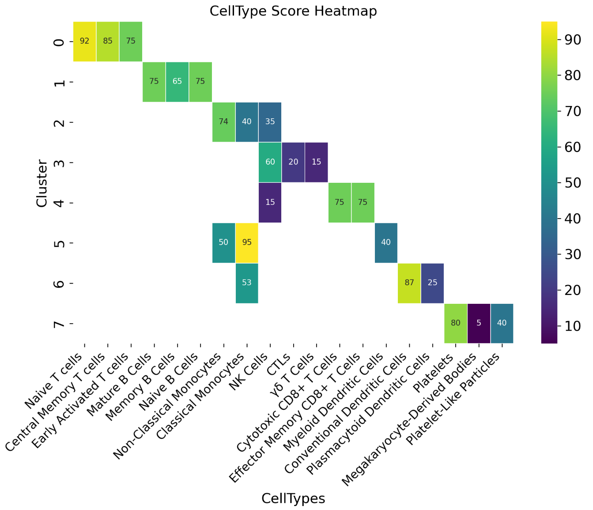
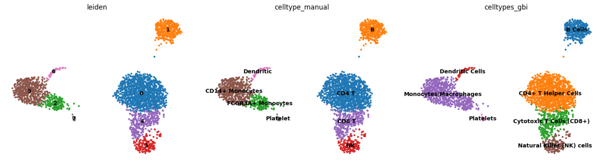

# 细胞类型注释

## 安装 

使用pip安装GPTBioinsightor:

```shell
pip install gptbioinsightor
```

## 使用


### 示例数据演示

使用经典的10X Genomics PBMC数据进行演示。GPTBioinsightor 是个Python程序，我们使用Scanpy进行单细胞数据分析。

在Unix系统下，可以这么下载数据：
```shell
mkdir data
wget http://cf.10xgenomics.com/samples/cell-exp/1.1.0/pbmc3k/pbmc3k_filtered_gene_bc_matrices.tar.gz -O data/pbmc3k_filtered_gene_bc_matrices.tar.gz
cd data; tar -xzf pbmc3k_filtered_gene_bc_matrices.tar.gz
```

然后在Python环境进行单细胞数据处理：
```python

# 更详细的scanpy数据处理参考 https://scanpy.readthedocs.io/en/stable/tutorials/basics/clustering-2017.html

import scanpy as sc

adata = sc.read_10x_mtx(
    "data/filtered_gene_bc_matrices/hg19/",  # the directory with the `.mtx` file
    var_names="gene_symbols",  # use gene symbols for the variable names (variables-axis index)
    cache=True,  # write a cache file for faster subsequent reading
)

adata.var_names_make_unique()  

sc.pp.filter_cells(adata, min_genes=200)
sc.pp.filter_genes(adata, min_cells=3)

# annotate the group of mitochondrial genes as "mt"
adata.var["mt"] = adata.var_names.str.startswith("MT-")
sc.pp.calculate_qc_metrics(
    adata, qc_vars=["mt"], percent_top=None, log1p=False, inplace=True
)

adata = adata[adata.obs.n_genes_by_counts < 2500, :]
adata = adata[adata.obs.pct_counts_mt < 5, :].copy()

sc.pp.normalize_total(adata, target_sum=1e4)

sc.pp.log1p(adata)

sc.pp.highly_variable_genes(adata, min_mean=0.0125, max_mean=3, min_disp=0.5)
adata.raw = adata
adata = adata[:, adata.var.highly_variable]

sc.pp.regress_out(adata, ["total_counts", "pct_counts_mt"])

sc.pp.scale(adata, max_value=10)
sc.tl.pca(adata, svd_solver="arpack")
sc.pp.neighbors(adata, n_neighbors=10, n_pcs=40)

sc.tl.leiden(
    adata,
    resolution=0.9,
    random_state=0,
    flavor="igraph",
    n_iterations=2,
    directed=False,
)
sc.tl.umap(adata)
sc.tl.rank_genes_groups(adata, "leiden", key_added="deg_key")
pathway_dic = gbi.enrich(adata, key="deg_key", pval=0.05, n_jobs=2, gene_sets="WikiPathways_2024_Human")
```

使用GPTBioinsightor进行细胞类型注解
```python
### 设置大语言模型的 API KEY
import os
os.environ['API_KEY'] = "sk-***"

import gptbioinsightor as gbi
# 设置数据的背景信息
background = "Cells are PBMCs from a Healthy Donor" 

# 使用阿里的通义千问qwen-max-latest
# 也可以设置成其他模型
# if you also want to list references papers, 
# you should set , search_model="sonar", and set PERPLEXITY_API_KEY
res = gbi.get_celltype(adata, background=background, 
                       out="gbi.qwen.celltype.md", key="deg_key", 
                       topnumber=15,provider="aliyun", 
                       n_jobs=4,model="qwen-max-latest")
res
# {'0': 'CD4+ T Helper Cells',
#  '1': 'B Cells',
#  '2': 'Monocytes/Macrophages',
#  '3': 'Natural Killer (NK) cells',
#  '4': 'Cytotoxic T Cells (CD8+)',
#  '5': 'Monocytes/Macrophages',
#  '6': 'Dendritic Cells',
#  '7': 'Platelets'}
## score heatmap
gbi.utils.score_heatmap(res)
```



和基于已知gene marker的手动注释的结果进行比较
```python
cell_type_name = {
    "0": "CD4 T",
    "1": "B",
    "2": "FCGR3A+ Monocytes",
    "3": "NK",
    "4": "CD8 T",
    "5": "CD14+ Monocytes",
    "6": "Dendritic",
    "7": "Platelet",
}

adata.obs["celltype_manual"] = adata.obs["leiden"].map(
    cell_type_name
)
adata.obs["celltypes_gbi"] = adata.obs["leiden"].map(
    res
)
sc.pl.umap(adata, color=["leiden", "celltype_manual", "celltypes_gbi"], legend_loc="on data", frameon=False)

```



其中`gbi.qwen.celltype.md` 内容如下：
```markdown
# CellType Analysis
## cluster geneset 0

### Gene List
'''
LDHB, LTB, RGCC, IL32, NOSIP, CD3D, CD3E, TMEM123, VIM, TMEM66, FYB, JUNB, CCR7, CD27, MYL12A
'''

### Celltype Prediction
#### Optimal Celltype: T Cells (likely CD4+ T cells)
**Key Markers**:
- Cell-specific: CD3D, CD3E, CCR7, CD27, FYB
- Context-specific: LTB, JUNB, VIM

**Evidence and Reasoning**
- **PRIMARY EVIDENCE**: The presence of CD3D and CD3E, which are essential components of the T cell receptor complex, strongly indicates a T cell population. These markers are highly specific to T cells.
- **SECONDARY EVIDENCE**: CCR7 is a chemokine receptor that is typically expressed on naïve and central memory T cells, suggesting that these cells may be in a non-activated or memory state.
- **ADDITIONAL EVIDENCE**: CD27 and FYB are also known to be expressed in T cells, particularly in activated T cells. LTB (lymphotoxin beta) and JUNB (a transcription factor) are involved in T cell activation and function.

**Validation**: Other gold standard markers for T cells (not in Geneset 0) include CD4, CD8, and TCRα/β. For CD4+ T cells, additional markers like CD45RA and CD45RO can be used to distinguish between naïve and memory T cells.

#### Alternative Considerations
- **Alternative celltype1: NK cells**
    - **WHY Alternative? Key MARKERS, Evidence and Reasoning**: NK cells can express some of the markers found in this geneset, such as CCR7 and CD27, but the presence of CD3D and CD3E, which are not expressed in NK cells, makes this less likely.
    - **OTHER Gold Standard MARKERS(NOT IN Geneset 0) TO VALIDATE THE Alternative celltype1**: NK cells would typically express NKp46, KIRs, and NKG2D, which are not present in this geneset.

- **Alternative celltype2: B cells**
    - **WHY Alternative? Key MARKERS, Evidence and Reasoning**: B cells do not typically express CD3D and CD3E, which are strong T cell markers. However, some B cell markers like CD27 and CCR7 are present, which might lead to confusion. The absence of B cell-specific markers like CD19 and CD20 makes this alternative less likely.
    - **OTHER Gold Standard MARKERS(NOT IN Geneset 0) TO VALIDATE THE Alternative celltype2**: B cells would typically express CD19, CD20, and surface IgM, which are not present in this geneset.

### Novel Insights
- **NOTEWORTHY PATTERNS**: The co-expression of CCR7 and CD27 suggests a population of T cells that are either naïve or central memory T cells.
- **CELL STATE**: The expression of JUNB and LTB, along with other activation-related genes, suggests that these T cells may be in an activated or recently activated state.
- **POTENTIAL NEW FINDINGS**: The presence of VIM (vimentin), a marker often associated with mesenchymal cells, in T cells is intriguing and could indicate a unique subset of T cells or a state of T cells that have undergone some form of stress or activation leading to the upregulation of vimentin.
## cluster geneset 1

### Gene List
'''
CD79A,HLA-DRA,MS4A1,CD79B,CD74,HLA-DPB1,HLA-DRB1,HLA-DQA1,CD37,HLA-DPA1,HLA-DQB1,LINC00926,LTB,TCL1A,HLA-DRB5
'''

### Celltype Prediction
#### Optimal Celltype: B cells
**Key Markers**:
- Cell-specific: CD79A, CD79B, MS4A1 (CD20), HLA-DRA, HLA-DPB1, HLA-DRB1, HLA-DQA1, HLA-DPA1, HLA-DQB1, HLA-DRB5
- Context-specific: CD74, LTB, TCL1A

**Evidence and Reasoning**
- **Primary Evidence**: The presence of CD79A and CD79B, which are components of the B cell receptor (BCR) complex, strongly indicates that these cells are B cells. These markers are essential for B cell development and function.
- **Secondary Evidence**: MS4A1 (CD20) is a well-known B cell marker. It is expressed on the surface of all B cells except plasma cells and is a key marker for identifying B cells in various contexts.
- **Additional Evidence**: The high expression of multiple HLA class II genes (HLA-DRA, HLA-DPB1, HLA-DRB1, HLA-DQA1, HLA-DPA1, HLA-DQB1, HLA-DRB5) suggests that these B cells are activated or mature, as HLA class II molecules are upregulated during B cell activation to present antigens to T cells.

**Validation**: Other gold standard markers not in the geneset to validate the optimal celltype include:
- CD19
- PAX5
- CD21

#### Alternative Considerations
- **Alternative celltype1: Dendritic Cells (DCs)**
    - **Why Alternative? Key Markers, Evidence and Reasoning**: While some HLA class II genes (e.g., HLA-DRA, HLA-DRB1) are also highly expressed in dendritic cells, the absence of specific DC markers such as CD83, CD11c, and CLEC9A makes this less likely. Additionally, the presence of B cell-specific markers like CD79A and CD79B rules out DCs.
    - **Other Gold Standard Markers (NOT IN Geneset 1) to Validate the Alternative celltype1**: 
        - CD83
        - CD11c
        - CLEC9A

- **Alternative celltype2: Monocytes/Macrophages**
    - **Why Alternative? Key Markers, Evidence and Reasoning**: Monocytes and macrophages can express some HLA class II genes, but they typically do not express B cell-specific markers like CD79A and CD79B. The presence of these B cell markers makes it unlikely that these are monocytes or macrophages.
    - **Other Gold Standard Markers (NOT IN Geneset 1) to Validate the Alternative celltype2**: 
        - CD14
        - CD68
        - CSF1R

### Novel Insights
- **Noteworthy Patterns**: The co-expression of multiple HLA class II genes and B cell-specific markers (CD79A, CD79B, MS4A1) suggests that these B cells are in an activated state, possibly involved in antigen presentation.
- **Cell State**: The high expression of HLA class II genes and LTB (lymphotoxin beta) indicates that these B cells are likely in an activated or memory state, possibly engaged in immune responses.
- **Potential New Findings**: The presence of TCL1A, which is associated with B cell maturation and proliferation, suggests that these B cells may be in a proliferative or developmental stage, potentially responding to an ongoing immune challenge.
## cluster geneset 2

### Gene List
'''
FCGR3A, LST1, MT2A, FCER1G, IFITM2, AIF1, LILRA3, RHOC, IFITM3, STXBP2, PSAP, SAT1, NINJ1, MS4A7, ABI3
'''

### Celltype Prediction
#### Optimal Celltype: Monocytes
**Key Markers**:
- Cell-specific: **FCGR3A, FCER1G, AIF1, LILRA3, RHOC, NINJ1, MS4A7, ABI3**
- Context-specific: **LST1, MT2A, IFITM2, IFITM3, PSAP, SAT1, STXBP2**

**Evidence and Reasoning**
- **PRIMARY EVIDENCE**: 
  - **FCGR3A (CD16)** is a well-known marker for monocytes, particularly classical monocytes.
  - **FCER1G** is involved in the immune response and is often expressed in monocytes and macrophages.
  - **AIF1 (ALLOGRAFT INFLAMMATORY FACTOR 1)** is a marker for activated monocytes and macrophages.
  - **LILRA3** is part of the leukocyte immunoglobulin-like receptor family, which is expressed in myeloid cells including monocytes.

- **SECONDARY EVIDENCE**:
  - **LST1** is associated with the regulation of immune responses and is highly expressed in monocytes.
  - **MT2A (Metallothionein 2A)** can be upregulated in monocytes under certain stress conditions, such as inflammation or oxidative stress.
  - **IFITM2 and IFITM3** are interferon-induced transmembrane proteins that are often upregulated in monocytes during viral infections or other inflammatory conditions.
  - **PSAP (Prosaposin)** is involved in lysosomal functions and is expressed in various immune cells, including monocytes.
  - **SAT1 (Spermidine/Spermine N1-Acetyltransferase 1)** is involved in polyamine metabolism and can be upregulated in monocytes under certain conditions.

- **ADDITIONAL EVIDENCE**:
  - **RHOC (RhoC GTPase)** is involved in cell migration and can be upregulated in monocytes during inflammatory responses.
  - **NINJ1 (Ninjurin 1)** is involved in cell adhesion and is expressed in monocytes and other immune cells.
  - **MS4A7** is a member of the membrane-spanning 4-domain subfamily A, which is expressed in myeloid cells, including monocytes.
  - **ABI3** is involved in actin cytoskeleton organization and is expressed in monocytes and macrophages.

**Validation**: Other gold standard markers to validate the optimal celltype (monocytes) include **CD14, CD163, and CCR2**.

#### Alternative Considerations
- **Alternative celltype1: Macrophages**
    - **WHY Alternative? Key MARKERS, Evidence and Reasoning**:
      - **FCER1G, AIF1, and ABI3** are also expressed in macrophages.
      - **LST1, MT2A, IFITM2, and IFITM3** can be upregulated in macrophages under similar stress or inflammatory conditions.
      - **PSAP and SAT1** are also involved in lysosomal functions and polyamine metabolism, which are relevant in macrophages.
    - **OTHER Gold Standard MARKERS(NOT IN Geneset 2) TO VALIDATE THE Alternative celltype1**: **CD68, CD163, and CSF1R**.

- **Alternative celltype2: Dendritic Cells (DCs)**
    - **WHY Alternative? Key MARKERS, Evidence and Reasoning**:
      - **FCGR3A** is also expressed in some dendritic cell subsets.
      - **FCER1G** is involved in immune responses and is expressed in DCs.
      - **LST1, MT2A, IFITM2, and IFITM3** can be upregulated in DCs under similar conditions.
    - **OTHER Gold Standard MARKERS(NOT IN Geneset 2) TO VALIDATE THE Alternative celltype2**: **CD11c, HLA-DR, and CD80/CD86**.

### Novel Insights
- **NOTEWORTHY PATTERNS**:
  - The presence of **FCGR3A, FCER1G, AIF1, and LILRA3** suggests a strong myeloid lineage, with a focus on monocytes.
  - The upregulation of **IFITM2 and IFITM3** indicates a potential viral infection or inflammatory state.
- **CELL STATE**:
  - The expression of **LST1, MT2A, and PSAP** suggests that these monocytes may be in an activated or stressed state, possibly due to an ongoing immune response.
- **POTENTIAL NEW FINDINGS**:
  - The combination of **FCGR3A, LILRA3, and RHOC** suggests that these monocytes might be involved in phagocytosis and migration, which could be further explored in the context of their functional roles.
## cluster geneset 3

### Gene List
'''
GNLY, GZMB, FGFBP2, NKG7, PRF1, CTSW, TYROBP, FCGR3A, SPON2, XCL2, FCER1G, GZMA, HOPX, ID2, PLAC8
'''

### Celltype Prediction
#### Optimal Celltype: NK Cells
**Key Markers**:
- Cell-specific: GNLY, GZMB, NKG7, PRF1, CTSW, GZMA
- Context-specific: TYROBP, FCGR3A, FCER1G

**Evidence and Reasoning**
- **Primary Evidence**: The presence of GNLY (Granzyme B), GZMB (Granzyme B), NKG7, PRF1 (Perforin), and CTSW (Cathepsin W) are well-established markers for Natural Killer (NK) cells. These genes are involved in the cytotoxic function of NK cells, which is a hallmark of their role in immune surveillance and response.
- **Secondary Evidence**: TYROBP (DAP12) and FCGR3A (CD16a) are also expressed in NK cells and play roles in activating these cells. Additionally, FCER1G (Fc epsilon R1 gamma) is involved in the signaling pathway of Fc receptors, which can be found in NK cells.
- **Additional Evidence**: The expression of HOPX and ID2 further supports the NK cell identity. HOPX has been implicated in the regulation of NK cell development and function, while ID2 is known to be involved in the maintenance of the NK cell lineage.

**Validation**: Other gold standard markers for NK cells not present in the gene set include KIR2DL4, CD56, and CD94.

#### Alternative Considerations
- **Alternative celltype1: Cytotoxic T Cells**
    - **Why Alternative? Key Markers, Evidence and Reasoning**: Cytotoxic T cells (CD8+ T cells) share some of the same cytotoxic machinery as NK cells, including GZMB, PRF1, and CTSW. However, the absence of key T cell markers such as CD8A and TCR components (e.g., TRAC, TRBC) makes this less likely.
    - **Other Gold Standard Markers (NOT IN Geneset 3) TO VALIDATE THE Alternative celltype1**: CD8A, TRAC, TRBC

- **Alternative celltype2: Innate Lymphoid Cells (ILCs)**
    - **Why Alternative? Key Markers, Evidence and Reasoning**: ILCs, particularly ILC1, can express some of the same markers as NK cells, such as GNLY and GZMB. However, the presence of NKG7 and the overall profile are more consistent with NK cells.
    - **Other Gold Standard Markers (NOT IN Geneset 3) TO VALIDATE THE Alternative celltype2**: RORC, IL22, IFNG

### Novel Insights
- **Noteworthy Patterns**: The co-expression of multiple cytotoxic molecules (GNLY, GZMB, PRF1, CTSW, GZMA) suggests a highly active and functional state of the NK cells, likely in a context where they are engaged in an immune response.
- **Cell State**: The upregulation of these genes indicates that the NK cells are in an activated or effector state, possibly responding to a viral infection or other immune challenge.
- **Potential New Findings**: The presence of HOPX and ID2, along with the established NK cell markers, provides a more detailed picture of the transcriptional landscape of activated NK cells, which could be useful for understanding their specific functions and regulatory mechanisms in different contexts.
## cluster geneset 4

### Gene List
'''
CCL5, GZMK, NKG7, CST7, CD3D, GZMA, CTSW, CD8A, KLRG1, GZMH, IL32, LYAR, S100A6, NCR3, HCST
'''

### Celltype Prediction
#### Optimal Celltype: Cytotoxic T Cells (CD8+ T Cells)
**Key Markers**:
- Cell-specific: `CD8A`, `GZMA`, `GZMK`, `GZMH`, `KLRG1`, `NKG7`, `CTSW`
- Context-specific: `CCL5`, `IL32`, `NCR3`, `HCST`

**Evidence and Reasoning**
- **PRIMARY EVIDENCE**: The presence of `CD8A` is a strong indicator of CD8+ T cells. Additionally, the granzymes (`GZMA`, `GZMK`, `GZMH`) and perforin (`PRF1`, not in this list but often co-expressed) are key markers for cytotoxic T cells.
- **SECONDARY EVIDENCE**: `NKG7` is highly expressed in both NK and CD8+ T cells, and its presence here, along with other T cell markers, supports the CD8+ T cell identity.
- **ADDITIONAL EVIDENCE AS NEEDED**: `KLRG1` is a marker of terminally differentiated effector memory CD8+ T cells, indicating that these cells may be in a more mature or activated state.

**Validation**: Other Gold Standard Markers (NOT IN Geneset 4) TO VALIDATE THE OPTIMAL CELLTYPE
- `PRF1` (Perforin)
- `IFNG` (Interferon-gamma)
- `T-BET` (TBX21)

#### Alternative Considerations
- **Alternative celltype1: Natural Killer (NK) Cells**
    - **WHY Alternative? Key MARKERS, Evidence and Reasoning**: `NKG7` and `NCR3` are also highly expressed in NK cells. However, the presence of `CD8A` and multiple granzyme genes strongly favors CD8+ T cells over NK cells.
    - **OTHER Gold Standard MARKERS(NOT IN Geneset 4) TO VALIDATE THE Alternative celltype1**
        - `KIR2DL4`
        - `KIR3DL1`
        - `KIR3DL2`

- **Alternative celltype2: Effector Memory CD8+ T Cells**
    - **WHY Alternative? Key MARKERS, Evidence and Reasoning**: `KLRG1` is a marker of terminally differentiated effector memory CD8+ T cells. This suggests that the cells could be in an effector memory state, which is a subtype of CD8+ T cells.
    - **OTHER Gold Standard MARKERS(NOT IN Geneset 4) TO VALIDATE THE Alternative celltype2**
        - `CCR7` (low expression in effector memory cells)
        - `CD45RA` (high expression in some effector memory cells)
        - `IL7R` (low expression in effector memory cells)

### Novel Insights
- **NOTEWORTHY PATTERNS**: The co-expression of `CCL5` and `IL32` with cytotoxic markers suggests that these cells are not only involved in direct cytotoxicity but also in chemotaxis and immune signaling.
- **CELL STATE**: The presence of `KLRG1` indicates that these cells are likely in a terminally differentiated effector memory state, suggesting they are capable of rapid and potent responses to previously encountered antigens.
- **POTENTIAL NEW FINDINGS**: The expression of `LYAR` and `S100A6` in this context is intriguing and may indicate additional roles in cellular regulation or function that are not yet fully understood. Further investigation into these genes in the context of CD8+ T cell biology could provide new insights.
## cluster geneset 5

### Gene List
'''
S100A8, LYZ, S100A9, LGALS2, FCN1, CD14, GSTP1, FTL, MS4A6A, CFD, NPC2, TYROBP, GRN, APOBEC3A, GPX1
'''

### Celltype Prediction
#### Optimal Celltype: Monocytes
**Key Markers**:
- Cell-specific: `CD14`, `LYZ`, `S100A8`, `S100A9`, `FCN1`
- Context-specific: `GSTP1`, `FTL`, `GRN`, `APOBEC3A`, `GPX1`

**Evidence and Reasoning**
- **Primary Evidence**: The presence of `CD14` is a strong indicator of monocytes, as it is a well-known marker for this cell type. Additionally, `S100A8` and `S100A9` are highly expressed in monocytes and are involved in the inflammatory response.
- **Secondary Evidence**: `LYZ` (lysozyme) and `FCN1` (ficolin-1) are also commonly associated with monocytes, where they play roles in pathogen recognition and phagocytosis.
- **Additional Evidence**: The expression of `GSTP1`, `FTL`, `GRN`, `APOBEC3A`, and `GPX1` suggests that these monocytes may be in a state of oxidative stress or immune activation, which is common in the context of PBMCs from healthy donors.

**Validation**: Other gold standard markers to validate the optimal celltype include `CD68`, `CSF1R`, and `ITGAM`.

#### Alternative Considerations
- **Alternative celltype1: Neutrophils**
    - **Why Alternative? Key Markers, Evidence and Reasoning**: Neutrophils can also express `S100A8`, `S100A9`, and `LYZ`. However, the presence of `CD14` and `FCN1` is more characteristic of monocytes than neutrophils.
    - **Other Gold Standard Markers to Validate the Alternative celltype1**: `ELANE`, `MPO`, `CXCR2`

- **Alternative celltype2: Macrophages**
    - **Why Alternative? Key Markers, Evidence and Reasoning**: Macrophages can express `S100A8`, `S100A9`, `LYZ`, and `FCN1`. However, the high expression of `CD14` and the lack of other macrophage-specific markers like `CD68` and `CSF1R` make monocytes a more likely candidate.
    - **Other Gold Standard Markers to Validate the Alternative celltype2**: `CD68`, `CSF1R`, `EMR1`

### Novel Insights
- **Noteworthy Patterns**: The co-expression of `S100A8` and `S100A9` with `CD14` and `FCN1` indicates a potential role in inflammation and immune response.
- **Cell State**: The expression of `GSTP1`, `FTL`, `GRN`, `APOBEC3A`, and `GPX1` suggests that these monocytes may be in a state of oxidative stress or immune activation, possibly due to environmental factors or physiological conditions.
- **Potential New Findings**: The presence of `NPC2` and `TYROBP` in this gene set is intriguing, as these genes are not typically associated with monocytes. This could indicate a novel function or state of these monocytes, such as involvement in lipid metabolism or immune signaling pathways.
## cluster geneset 6

### Gene List
'''
FCER1A, HLA-DQA1, HLA-DPB1, CLEC10A, HLA-DQB1, HLA-DRA, HLA-DPA1, CST3, LYZ, HLA-DRB1, CD74, HLA-DQA2, HLA-DMA, HLA-DRB5, SRSF7
'''

### Celltype Prediction
#### Optimal Celltype: Dendritic Cells (DCs)
**Key Markers**:
- Cell-specific: FCER1A, CLEC10A, CD74
- Context-specific: HLA-DRA, HLA-DPB1, HLA-DQB1, HLA-DPA1, HLA-DRB1, HLA-DRB5, HLA-DMA, HLA-DQA1, HLA-DQA2

**Evidence and Reasoning**
- **PRIMARY EVIDENCE**: The presence of MHC class II genes (HLA-DRA, HLA-DPB1, HLA-DQB1, HLA-DPA1, HLA-DRB1, HLA-DRB5, HLA-DMA, HLA-DQA1, HLA-DQA2) is a strong indicator of antigen-presenting cells, particularly dendritic cells. These genes are crucial for the presentation of antigens to T cells.
- **SECONDARY EVIDENCE**: FCER1A (Fc fragment of IgE receptor Ia) is highly expressed in plasmacytoid dendritic cells (pDCs) and some myeloid dendritic cells (mDCs), which play a role in immune responses to allergens and pathogens.
- **ADDITIONAL EVIDENCE AS NEEDED**: CLEC10A (C-type lectin domain family 10 member A) is a marker for DCs, especially in the context of pathogen recognition and immune response. CD74, also known as invariant chain, is involved in the processing and presentation of antigens via MHC class II, further supporting the DC identity.

**Validation**: Other gold standard markers not in Geneset 6 that could validate this cell type include CD83, CD11c, and BDCA-2 (CD303).

#### Alternative Considerations
- **Alternative celltype1: B cells**
    - **WHY Alternative? Key MARKERS, Evidence and Reasoning**: While MHC class II genes (HLA-DRA, HLA-DPB1, HLA-DQB1, HLA-DPA1, HLA-DRB1, HLA-DRB5, HLA-DMA, HLA-DQA1, HLA-DQA2) are also expressed in B cells, the presence of FCER1A and CLEC10A is less typical for B cells. Additionally, B cell-specific markers like CD19 and CD20 are absent.
    - **OTHER Gold Standard MARKERS(NOT IN Geneset 6) TO VALIDATE THE Alternative celltype1**: CD19, CD20, and PAX5.

- **Alternative celltype2: Macrophages**
    - **WHY Alternative? Key MARKERS, Evidence and Reasoning**: Macrophages can express MHC class II genes and CD74, but the presence of FCER1A and CLEC10A is more specific to DCs. Additionally, macrophage-specific markers like CD68 and CD163 are not present.
    - **OTHER Gold Standard MARKERS(NOT IN Geneset 6) TO VALIDATE THE Alternative celltype2**: CD68, CD163, and CSF1R.

### Novel Insights
- **NOTEWORTHY PATTERNS**: The high expression of MHC class II genes suggests an active state of antigen presentation, indicating that these cells are likely involved in immune surveillance and activation.
- **CELL STATE**: The presence of multiple MHC class II genes and CD74 suggests that these cells are in an activated or mature state, possibly responding to an ongoing immune challenge.
- **POTENTIAL NEW FINDINGS**: The co-expression of FCER1A and CLEC10A with MHC class II genes may indicate a specialized subset of dendritic cells, potentially with unique functional properties in the context of PBMCs from a healthy donor.
## cluster geneset 7

### Gene List
'''
PPBP, PF4, GNG11, GPX1, SDPR, NRGN, CCL5, SPARC, HIST1H2AC, TPM4, CLU, TUBB1, RGS10, GP9, TAGLN2
'''

### Celltype Prediction
#### Optimal Celltype: Platelets
**Key Markers**:
- Cell-specific: PPBP, PF4, GP9
- Context-specific: GPX1, CCL5, SPARC

**Evidence and Reasoning**
- **PRIMARY EVIDENCE**: The presence of PPBP (Pro-Platelet Basic Protein) and PF4 (Platelet Factor 4) are strong indicators of platelets. These genes are specifically expressed in megakaryocytes and their progeny, platelets.
- **SECONDARY EVIDENCE**: GP9 (Glycoprotein IX) is a well-known marker for platelets, further supporting the prediction.
- **ADDITIONAL EVIDENCE AS NEEDED**: Other genes like GPX1 (Glutathione Peroxidase 1), CCL5 (C-C Motif Chemokine Ligand 5), and SPARC (Secreted Protein Acidic and Rich in Cysteine) are also found in platelets, though they can be present in other cell types as well.

**Validation**: Other Gold Standard MARKERS(NOT IN Geneset 7) TO VALIDATE THE OPTIMAL CELLTYPE
- ITGA2B (Integrin Subunit Alpha 2b)
- ITGB3 (Integrin Subunit Beta 3)
- CD41 (GPIIb/IIIa complex)

#### Alternative Considerations
- Alternative celltype1: Megakaryocytes
    - **WHY Alternative? Key MARKERS, Evidence and Reasoning**: Megakaryocytes, the precursors to platelets, also express PPBP and PF4. However, the presence of GP9 is more specific to mature platelets. The lack of other megakaryocyte-specific markers such as MPL (Myeloproliferative Leukemia Virus Oncogene) and TPO (Thrombopoietin) makes this less likely.
    - **OTHER Gold Standard MARKERS(NOT IN Geneset 7) TO VALIDATE THE Alternative celltype1**: MPL, TPO, VWF (Von Willebrand Factor)

- Alternative celltype2: Neutrophils
    - **WHY Alternative? Key MARKERS, Evidence and Reasoning**: Some of the genes, such as CCL5 and SPARC, are also expressed in neutrophils. However, the presence of platelet-specific markers like PPBP, PF4, and GP9 strongly argues against this alternative.
    - **OTHER Gold Standard MARKERS(NOT IN Geneset 7) TO VALIDATE THE Alternative celltype2**: ELANE (Elastase, Neutrophil Expressed), MPO (Myeloperoxidase), CD66b (CEACAM8)

### Novel Insights
- **NOTEWORTHY PATTERNS**: The co-expression of PPBP, PF4, and GP9 in this cluster is a robust indicator of platelets, which is not typically seen in other PBMCs.
- **CELL STATE**: The gene expression profile suggests that these platelets are in a resting state, as there are no significant stress or activation markers present.
- **POTENTIAL NEW FINDINGS**: The inclusion of GPX1, an antioxidant enzyme, in the gene set might indicate a role in protecting platelets from oxidative stress, which could be a novel area for further investigation.
```